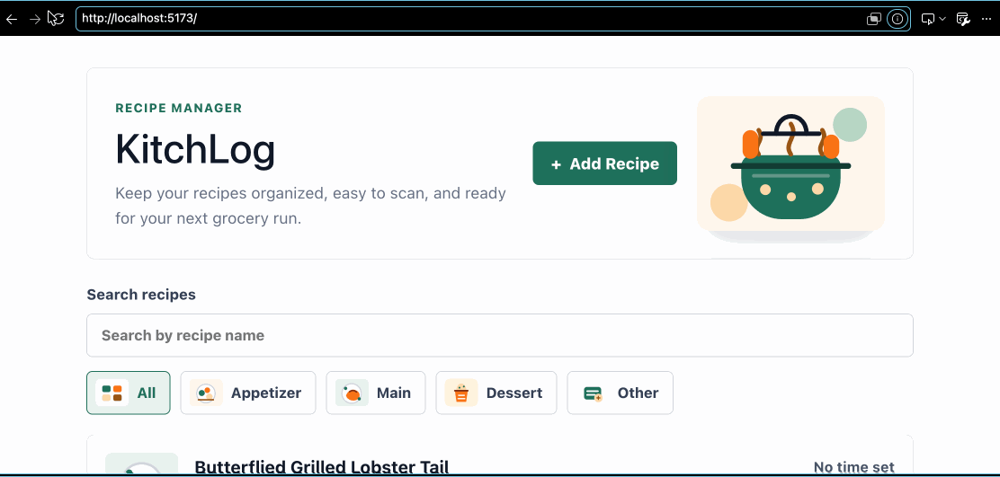
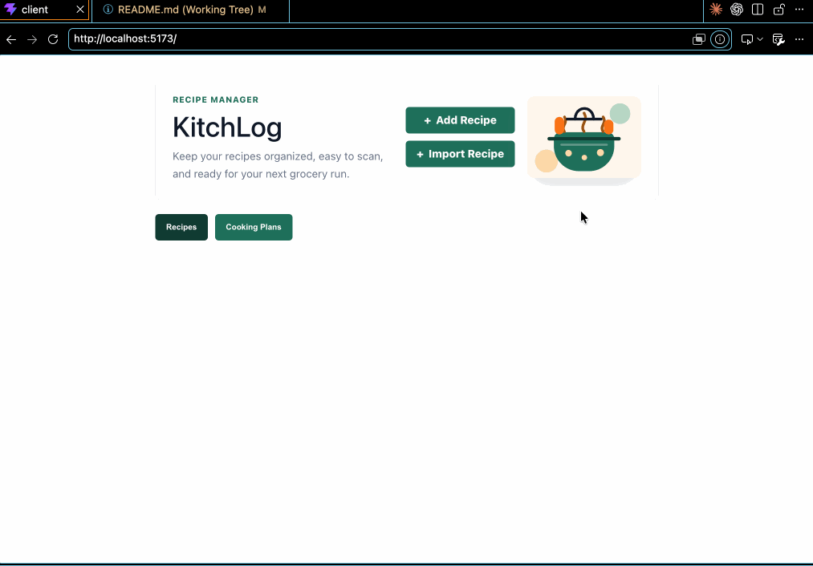
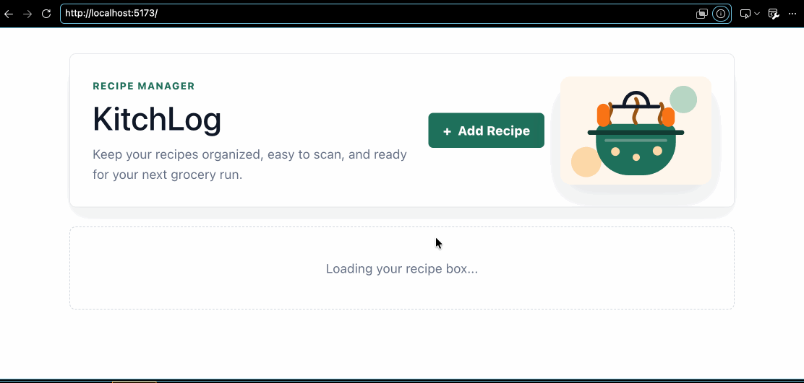

# KitchLog

CodePath WEB103 Final Project

Designed and developed by: [Yumejichi Fujita](https://github.com/Yumejichi),  [Omar Alim Mohamed](https://github.com/thetireddude), [Viet Thai Nguyen](https://github.com/AlgoriThai07), [Sanvi Singh](https://github.com/sansin112)

🔗 Link to deployed app:

## About

### Description and Purpose

KitchLog is a full-stack web application that helps users organize recipes and simplify grocery shopping. Users can save recipes from different websites by adding a recipe link or entering recipe details manually. They can then select one or more recipes they want to cook, and the app automatically generates a combined grocery list based on the selected recipes, reducing the time spent planning meals and shopping.

The goal of KitchLog is to make cooking more organized and convenient by keeping recipes and grocery lists in one place. It also solves the common problem of losing track of recipes you've found online. Instead of searching the internet again and trying to remember the keywords or website you used, users can save recipes once and easily access them whenever they want to cook them again.

### Inspiration

Many people, including ourselves, save recipes from different websites and blogs, making them difficult to keep organized. We often find ourselves searching for the same recipe again because we can't remember where we originally found it, or we don't remember the recipe anymore. Creating a grocery list for multiple recipes can also be repetitive and time-consuming.

We wanted to build an application that solves these everyday problems by allowing users to save recipes in one place and automatically generate a grocery list based on the dishes they plan to cook. Our goal is to make cooking preparation more organized, convenient, and efficient.

## Tech Stack

Frontend: React, React Router, Vite, CSS

Backend: Node.js, Express, PostgreSQL, pg, dotenv, CORS

## Features

### ✅ Recipe Management

Browse saved recipes and manually create new recipes. Users can enter a title, category, cook time, servings, instructions, optional source URL, optional image URL, and one or more ingredients.



### ✅ Recipe Import from URL _(Backend)_

Backend endpoint can parse a recipe URL and return extracted recipe details and ingredients.

<div>
    <a href="https://www.loom.com/share/e0786738d2ca40faaea37d6c643e18a1">
      <p>Recipe Import from URL - Watch Video</p>
    </a>
    <a href="https://www.loom.com/share/e0786738d2ca40faaea37d6c643e18a1">
      
    </a>
</div>

### ✅ Recipe Import from URL _(Frontend)_

Frontend form where users can paste a recipe URL and import it directly into their saved recipes.

<div>
    <a href="https://www.loom.com/share/b50817bb7675447cb6cd35b919bfe927">
      <p>Import Recipe Frontend and Database Parsing - Watch Video</p>
    </a>
    <a href="https://www.loom.com/share/b50817bb7675447cb6cd35b919bfe927">
      
    </a>
  </div>

### ✅ Favorite recipes

Mark recipes as favorites for quick and easy access.

<div>
    <a href="https://www.loom.com/share/7b401f1fe0e54767b07bc5c50347a503">
      <p>Implement Favorite Toggle with PATCH API - Watch Video</p>
    </a>
    <a href="https://www.loom.com/share/7b401f1fe0e54767b07bc5c50347a503">
      
    </a>
  </div>
  



### ✅ Cooking Plan _(Backend)_

Backend endpoints support creating and managing cooking plans from saved recipes.

<div>
    <a href="https://www.loom.com/share/6d2d5090a4284e948359e2250b1e1d6d">
      <p>Cooking Plans Endpoints - Watch Video</p>
    </a>
    <a href="https://www.loom.com/share/6d2d5090a4284e948359e2250b1e1d6d">
      
    </a>
  </div>

### ✅ Cooking Plan _(Frontend)_

Frontend page where users can select saved recipes, create a cooking plan, and view planned recipes.

<div>
  <a href="https://www.loom.com/share/1402f85647f84d8a969a010129cb3c11">
    <p>Cooking Plan Frontend Demo - Watch Video</p>
  </a>
  <a href="https://www.loom.com/share/1402f85647f84d8a969a010129cb3c11">
    
  </a>
</div>

### ✅ Cooking Plan Details Page 

View a cooking plan's name and recipes added on a dedicated page. Users can also edit or delete the cooking plan from this page.

<div>
  <a href="https://www.loom.com/share/897cf0a9c5da451a8105e3b319e30a0a">
    <p>Cooking Plan Details Page - Watch Video</p>
  </a>
  <a href="https://www.loom.com/share/897cf0a9c5da451a8105e3b319e30a0a">
    
  </a>
</div>

### Automatic Grocery List

Automatically generate a combined grocery list by merging the ingredients from the selected recipes in a cooking plan.

[gif goes here]

### ✅ Recipe Search & Filter

Search recipes by name and filter them by category on the home page.



### ✅ Recipe Details Page

View a recipe's ingredients, cooking instructions, original recipe link, image, cook time, servings, and other details on a dedicated page. Users can also edit or delete a recipe from this page.


### [ADDITIONAL FEATURES GO HERE - ADD ALL FEATURES HERE IN THE FORMAT ABOVE; you will check these off and add gifs as you complete them]

### Grocery Checklist

Users can mark grocery list items as purchased or unpurchased while shopping, making it easier to keep track of what they still need to buy.

[gif goes here]

### Recipe Import from Image *(might implement)*

Upload a photo of a recipe and have the app use AI to automatically extract and populate the ingredients and instructions.

[gif goes here]

### AI Nutrition Analysis *(might implement)*

Estimate calories and basic nutrition information for a recipe using an AI API.

[gif goes here]

### User Authentication *(might implement)*

Allow users to create an account, log in, and securely access their own recipes and grocery lists.

[gif goes here]


## Installation Instructions

### Backend

1. Go to the backend folder:
   ```bash
   cd server
   ```

2. Install dependencies:
   ```bash
   npm install
   ```

3. Create a `server/.env` file and add your database connection string:
   ```bash
   DATABASE_URL=your_postgresql_connection_string
   ```

4. Seed the database if needed:
   ```bash
   npm run seed
   ```

5. Start the backend server:
   ```bash
   npm run dev
   ```

### Frontend

1. Go to the frontend folder:
   ```bash
   cd client
   ```

2. Install dependencies:
   ```bash
   npm install
   ```

3. Optional: create a `client/.env` file if your backend API is not running at `http://localhost:3000/api`:
   ```bash
   VITE_API_URL=http://localhost:3000/api
   ```

4. Start the frontend:
   ```bash
   npm run dev
   ```
