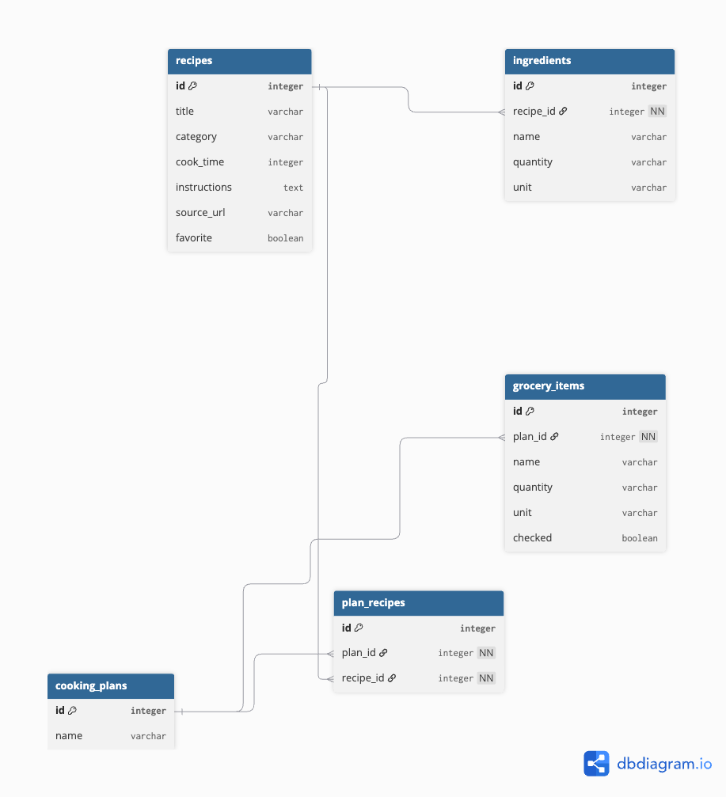

# Entity Relationship Diagram

Reference the Creating an Entity Relationship Diagram final project guide in the course portal for more information about how to complete this deliverable.

## Create the List of Tables

- Recipes
- Ingredients
- Cooking Plans
- Plan Recipes
- Grocery Items

## Add the Entity Relationship Diagram

### Recipes

| Column Name | Type | Description |
|-------------|------|-------------|
| id | integer | Primary key |
| title | varchar | Recipe title |
| category | varchar | Recipe category |
| cook_time | integer | Cooking time (minutes) |
| instructions | text | Cooking instructions |
| source_url | varchar | Original recipe URL |
| favorite | boolean | Indicates whether the recipe is favorited |

### Ingredients

| Column Name | Type | Description |
|-------------|------|-------------|
| id | integer | Primary key |
| recipe_id | integer | Foreign key referencing Recipes |
| name | varchar | Ingredient name |
| quantity | varchar | Ingredient quantity |
| unit | varchar | Unit of measurement |

### Cooking Plans

| Column Name | Type | Description |
|-------------|------|-------------|
| id | integer | Primary key |
| name | varchar | Name of the cooking plan |

### Plan Recipes

| Column Name | Type | Description |
|-------------|------|-------------|
| id | integer | Primary key |
| plan_id | integer | Foreign key referencing Cooking Plans |
| recipe_id | integer | Foreign key referencing Recipes |

### Grocery Items

| Column Name | Type | Description |
|-------------|------|-------------|
| id | integer | Primary key |
| plan_id | integer | Foreign key referencing Cooking Plans |
| name | varchar | Grocery item name |
| quantity | varchar | Quantity needed |
| unit | varchar | Unit of measurement |
| checked | boolean | Whether the item has been purchased |
