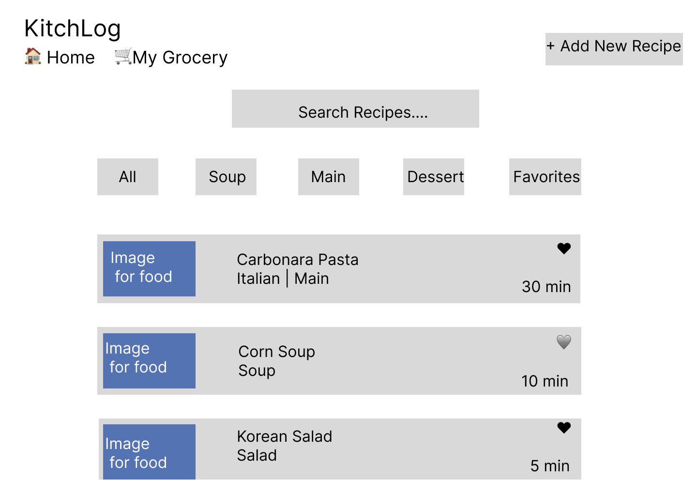
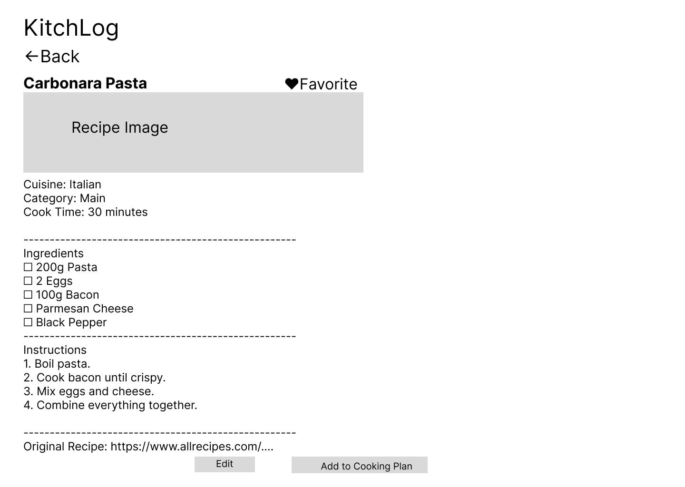
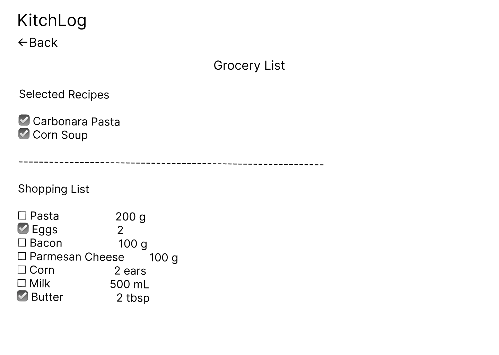

# Wireframes

Reference the Creating an Entity Relationship Diagram final project guide in the course portal for more information about how to complete this deliverable.

## List of Pages

⭐ Home Dashboard

⭐ Recipe Detail Page

⭐ Grocery List

Add Recipe Page (Manual Entry or Import from URL)

Cooking Plan Page

Edit Recipe Page

## Wireframe 1: Home Dashboard

The Home Dashboard allows users to browse their saved recipes, search by recipe name, filter recipes by category, and quickly add a new recipe or access their grocery list.

## Wireframe 2: Recipe Detail Page

The Recipe Detail page displays the selected recipe's image, ingredients, cooking instructions, category, cook time, and original recipe link. Users can also favorite, edit, or add the recipe to their grocery list or cooking plan.

## Wireframe 3: Grocery List

The Grocery List page displays the recipes selected for cooking and automatically generates a combined shopping list with ingredient quantities. Users can check off purchased items while shopping.

